# Human Resources Analytics : Exploration Data Analysis and modeling #         
[Reference](https://www.kaggle.com/yassineghouzam/don-t-know-why-employees-leave-read-this)

```python
import pandas as pd
import numpy as np
import matplotlib.pyplot as plt
import matplotlib as matplot
import seaborn as sns
%matplotlib inline
```


```python
from sklearn.model_selection import GridSearchCV, cross_val_score, learning_curve
from sklearn.cross_validation import StratifiedKFold
from sklearn.ensemble import RandomForestClassifier
from sklearn.preprocessing import StandardScaler, Normalizer, RobustScaler
from sklearn.decomposition import PCA
from sklearn.manifold import TSNE, Isomap
from sklearn.cluster import KMeans
from sklearn import tree
from sklearn.tree import DecisionTreeClassifier
import pydot
import pydotplus as pydot
from IPython.display import Image
from sklearn.externals.six import StringIO

from bokeh.io import output_notebook
from bokeh.plotting import figure, show, ColumnDataSource
from bokeh.models import HoverTool
output_notebook()
import warnings
warnings.filterwarnings('ignore')
sns.set(style='white', context='notebook',palette='deep')
np.random.seed(seed=2)
```

    /usr/local/lib/python3.5/dist-packages/sklearn/cross_validation.py:41: DeprecationWarning: This module was deprecated in version 0.18 in favor of the model_selection module into which all the refactored classes and functions are moved. Also note that the interface of the new CV iterators are different from that of this module. This module will be removed in 0.20.
      "This module will be removed in 0.20.", DeprecationWarning)


    <div class="bk-root">
        <a href="https://bokeh.pydata.org" target="_blank" class="bk-logo bk-logo-small bk-logo-notebook"></a>
        <span id="d261fe0c-439b-4835-8091-789a847a5f97">Loading BokehJS ...</span>
    </div>


```python
dataset = pd.read_csv("data.csv")
```


```python
dataset.shape

```


    (14999, 10)


```python
dataset.head()

```


<div>
<style>
    .dataframe thead tr:only-child th {
        text-align: right;
    }

    .dataframe thead th {
        text-align: left;
    }

    .dataframe tbody tr th {
        vertical-align: top;
    }
</style>
<table border="1" class="dataframe">
  <thead>
    <tr style="text-align: right;">
      <th></th>
      <th>satisfaction_level</th>
      <th>last_evaluation</th>
      <th>number_project</th>
      <th>average_montly_hours</th>
      <th>time_spend_company</th>
      <th>Work_accident</th>
      <th>left</th>
      <th>promotion_last_5years</th>
      <th>sales</th>
      <th>salary</th>
    </tr>
  </thead>
  <tbody>
    <tr>
      <th>0</th>
      <td>0.38</td>
      <td>0.53</td>
      <td>2</td>
      <td>157</td>
      <td>3</td>
      <td>0</td>
      <td>1</td>
      <td>0</td>
      <td>sales</td>
      <td>low</td>
    </tr>
    <tr>
      <th>1</th>
      <td>0.80</td>
      <td>0.86</td>
      <td>5</td>
      <td>262</td>
      <td>6</td>
      <td>0</td>
      <td>1</td>
      <td>0</td>
      <td>sales</td>
      <td>medium</td>
    </tr>
    <tr>
      <th>2</th>
      <td>0.11</td>
      <td>0.88</td>
      <td>7</td>
      <td>272</td>
      <td>4</td>
      <td>0</td>
      <td>1</td>
      <td>0</td>
      <td>sales</td>
      <td>medium</td>
    </tr>
    <tr>
      <th>3</th>
      <td>0.72</td>
      <td>0.87</td>
      <td>5</td>
      <td>223</td>
      <td>5</td>
      <td>0</td>
      <td>1</td>
      <td>0</td>
      <td>sales</td>
      <td>low</td>
    </tr>
    <tr>
      <th>4</th>
      <td>0.37</td>
      <td>0.52</td>
      <td>2</td>
      <td>159</td>
      <td>3</td>
      <td>0</td>
      <td>1</td>
      <td>0</td>
      <td>sales</td>
      <td>low</td>
    </tr>
  </tbody>
</table>
</div>


```python
dataset.isnull().any()

```


    satisfaction_level       False
    last_evaluation          False
    number_project           False
    average_montly_hours     False
    time_spend_company       False
    Work_accident            False
    left                     False
    promotion_last_5years    False
    sales                    False
    salary                   False
    dtype: bool


```python
fig, axs = plt.subplots(ncols=2,figsize=(12,6))
g = sns.countplot(dataset["sales"], ax = axs[0])
plt.setp(g.get_xticklabels(), rotation = 45)
g = sns.countplot(dataset["salary"], ax = axs[1])
plt.tight_layout()
plt.show();


```


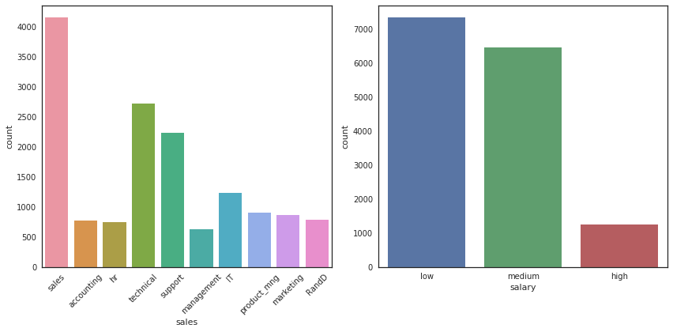


```python
fig, axs = plt.subplots(ncols=3, figsize=(12,6))
sns.countplot(dataset["Work_accident"], ax=axs[0])
sns.countplot(dataset["promotion_last_5years"], ax=axs[1])
sns.countplot(dataset["left"], ax=axs[2])
plt.tight_layout()
plt.show();
```


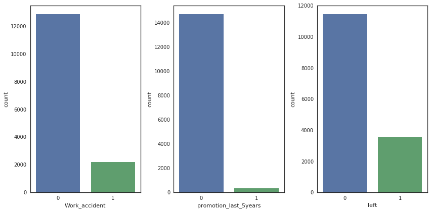


```python
fig, axs = plt.subplots(ncols=3, figsize=(12,6))
sns.distplot(dataset["satisfaction_level"], ax = axs[0])
sns.distplot(dataset["last_evaluation"], ax = axs[1])
sns.distplot(dataset["average_montly_hours"], ax=axs[2])
plt.tight_layout()
plt.show();
```


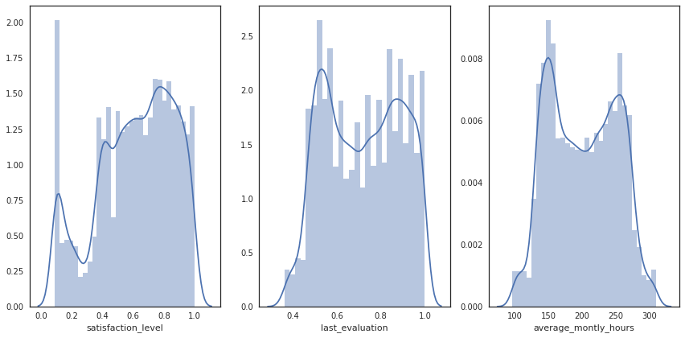


```python
fig,axs = plt.subplots(ncols=2, figsize=(12,6))
axs[0].hist(dataset["number_project"], bins=6)
axs[0].set_xlabel("number_project")
axs[0].set_ylabel("Count")
axs[1].hist(dataset["time_spend_company"], bins=6, color="r")
axs[1].set_xlabel("time_spend_company")
axs[1].set_ylabel("Count")
plt.tight_layout()
plt.show();
```


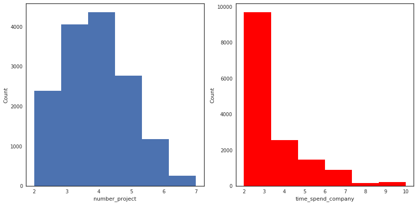


```python
g = sns.heatmap(dataset.corr(), annot=True, cmap="RdYlGn")
```


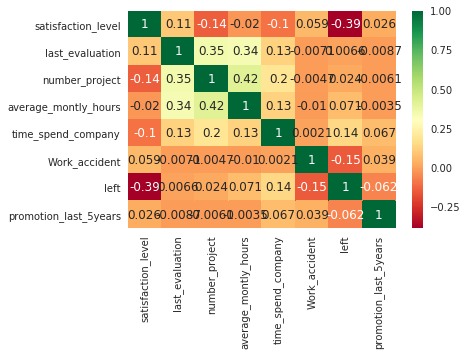


```python
dataset = dataset.drop(labels=["sales"],axis=1)

```


```python
dataset.head()
```


<div>
<style>
    .dataframe thead tr:only-child th {
        text-align: right;
    }

    .dataframe thead th {
        text-align: left;
    }

    .dataframe tbody tr th {
        vertical-align: top;
    }
</style>
<table border="1" class="dataframe">
  <thead>
    <tr style="text-align: right;">
      <th></th>
      <th>satisfaction_level</th>
      <th>last_evaluation</th>
      <th>number_project</th>
      <th>average_montly_hours</th>
      <th>time_spend_company</th>
      <th>Work_accident</th>
      <th>left</th>
      <th>promotion_last_5years</th>
      <th>salary</th>
    </tr>
  </thead>
  <tbody>
    <tr>
      <th>0</th>
      <td>0.38</td>
      <td>0.53</td>
      <td>2</td>
      <td>157</td>
      <td>3</td>
      <td>0</td>
      <td>1</td>
      <td>0</td>
      <td>low</td>
    </tr>
    <tr>
      <th>1</th>
      <td>0.80</td>
      <td>0.86</td>
      <td>5</td>
      <td>262</td>
      <td>6</td>
      <td>0</td>
      <td>1</td>
      <td>0</td>
      <td>medium</td>
    </tr>
    <tr>
      <th>2</th>
      <td>0.11</td>
      <td>0.88</td>
      <td>7</td>
      <td>272</td>
      <td>4</td>
      <td>0</td>
      <td>1</td>
      <td>0</td>
      <td>medium</td>
    </tr>
    <tr>
      <th>3</th>
      <td>0.72</td>
      <td>0.87</td>
      <td>5</td>
      <td>223</td>
      <td>5</td>
      <td>0</td>
      <td>1</td>
      <td>0</td>
      <td>low</td>
    </tr>
    <tr>
      <th>4</th>
      <td>0.37</td>
      <td>0.52</td>
      <td>2</td>
      <td>159</td>
      <td>3</td>
      <td>0</td>
      <td>1</td>
      <td>0</td>
      <td>low</td>
    </tr>
  </tbody>
</table>
</div>


```python
dataset["salary"] = dataset["salary"].astype("category", ordered=True,
                     categories=['low','medium','high']).cat.codes

```


```python
N = StandardScaler()
N.fit(dataset)
dataset_norm = N.transform(dataset)
```


```python
index = np.random.randint(0, dataset_norm.shape[0], size=10000)
```


```python
pca = PCA(n_components=2)
pca_representation = pca.fit_transform(dataset_norm[index])
```


```python
iso = Isomap(n_components=2, n_neighbors=40)
iso_representation = iso.fit_transform(dataset_norm[index])
```


```python
left_colors = dataset["left"].map(lambda s : "g" if s==0 else "r")
fig,axes = plt.subplots(1,2,figsize=(15,6))

axes[0].scatter(pca_representation[:,0],pca_representation[:,1],
c = left_colors[index],alpha=0.5, s = 20)
axes[0].set_title("Dimensionality reduction with PCA")
axes[0].legend(["Left employee"])

axes[1].scatter(iso_representation[:,0], iso_representation[:,1],
               c = left_colors[index],alpha=0.5, s = 20)
axes[1].set_title("Dimensionality reduction with Isomap")
axes[1].legend("Left employee");

```


```python
source_dataset = ColumnDataSource(
        data = dict(
            x = iso_representation[:2000,0],
            y = iso_representation[:2000,1],
            desc = dataset.loc[index,"left"],
            colors = ["#%02x%02x%02x" % (int(c*255), int((1-c)*255), 0) 
            for c in dataset.loc[index,"left"]],
            satisfaction_level = dataset.loc[index,'satisfaction_level'],
            last_evaluation = dataset.loc[index,'last_evaluation'],
            number_project = dataset.loc[index,'number_project'],
            time_spend_company = dataset.loc[index,'time_spend_company'],
            average_montly_hours = dataset.loc[index,'average_montly_hours']))
        
hover = HoverTool(tooltips=[("Left", "@desc"), 
                       ("Satisf. level", "@satisfaction_level"),
                       ("#projects", "@number_project"), 
                       ("Last eval.", "@last_evaluation"),
                       ("Time in Company", "@time_spend_company"),
                       ("Montly hrs", "@average_montly_hours")])

tools_isomap = [hover, "box_zoom",'pan', 'wheel_zoom', 'reset']

plot_isomap = figure(plot_width= 800, plot_height=600, tools=tools_isomap, 
                     title='Isomap projection of employee data')
plot_isomap.scatter('x', 'y', size=7, fill_color = "colors", line_color = None,
                    fill_alpha = 0.6, radius=0.1, alpha=0.5, line_width=0,
                    source=source_dataset)
show(plot_isomap)
```


<div class="bk-root">
    <div class="bk-plotdiv" id="39b4990f-8e81-4d5d-ab34-a2e05d354ede"></div>
</div>


```python
data_stay = dataset[dataset["left"]==0]
data_left = dataset[dataset["left"]==1]
```


```python
def _scale_data(data, ranges):
    (x1, x2) = ranges[0]
    d = data[0]
    return [(d - y1) / (y2 - y1) * (x2 - x1) + x1 for d, (y1, y2) in zip(data, ranges)]


class RadarChart():
    def __init__(self, fig, variables, ranges, n_ordinate_levels = 6):
        angles = np.arange(0, 360, 360./len(variables))

        axes = [fig.add_axes([0.1,0.1,0.8,0.8],polar = True, 
        label = "axes{}".format(i)) for i in range(len(variables))]
        _, text = axes[0].set_thetagrids(angles, labels = variables)
        
        for txt, angle in zip(text, angles):
            txt.set_rotation(angle - 90)
        
        for ax in axes[1:]:
            ax.patch.set_visible(False)
            ax.xaxis.set_visible(False)
            ax.grid("off")
        
        for i, ax in enumerate(axes):
            grid = np.linspace(*ranges[i],num = n_ordinate_levels)
            grid_label = [""]+["{:.1f}".format(x) for x in grid[1:]]
            ax.set_rgrids(grid, labels = grid_label, angle = angles[i])
            ax.set_ylim(*ranges[i])
        
        self.angle = np.deg2rad(np.r_[angles, angles[0]])
        self.ranges = ranges
        self.ax = axes[0]

    def plot(self, data, *args, **kw):
        sdata = _scale_data(data, self.ranges)
        self.ax.plot(self.angle, np.r_[sdata, sdata[0]], *args, **kw)

    def fill(self, data, *args, **kw):
        sdata = _scale_data(data, self.ranges)
        self.ax.fill(self.angle, np.r_[sdata, sdata[0]], *args, **kw)

    def legend(self, *args, **kw):
        self.ax.legend(*args, **kw)


attributes = ['satisfaction_level','last_evaluation','number_project',
              'average_montly_hours','time_spend_company']


data_stay_mean = data_stay[attributes].mean().values.reshape(1,-1)
data_left_mean = data_left[attributes].mean().values.reshape(1,-1)

datas = np.concatenate((data_stay_mean,data_left_mean),axis = 0)

ranges = [[1e-2, dataset[attr].max()] for attr in attributes]
colors = ["green","red"]
left_types = ["Stayed","Left"]


fig = plt.figure(figsize=(8, 8))
radar = RadarChart(fig, attributes, ranges)

for data, color, left_type in zip(datas, colors, left_types):
    radar.plot(data, color = color, label = left_type, linewidth=2.0)
    radar.fill(data, alpha = 0.2, color = color)
    radar.legend(loc = 1, fontsize = 'medium')

plt.title('Stats of employees who stayed and left')
plt.show();
```


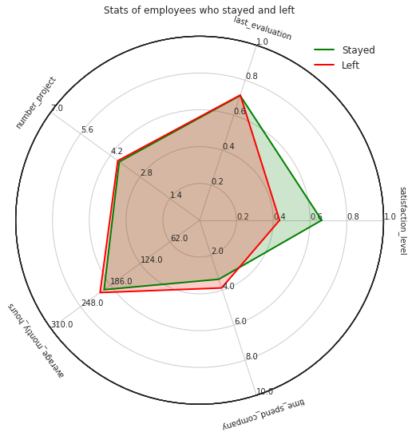


```python
fig, axs = plt.subplots(nrows=1,ncols=2,figsize=(10,6))
sns.factorplot(y="satisfaction_level",x="left",data=dataset,kind="box", ax=axs[0])
axs[1].hist(data_stay["satisfaction_level"],bins=6,label="Stay",alpha=0.7)
axs[1].hist(data_left["satisfaction_level"],bins=6,label="Left",alpha=0.7)
axs[1].set_xlabel("Satifaction level")
axs[1].set_ylabel("Count")
axs[1].legend();
plt.tight_layout();
plt.gcf().clear();
```


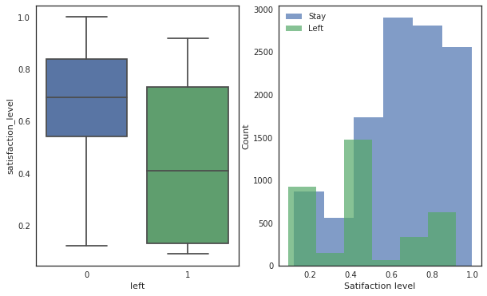


    <matplotlib.figure.Figure at 0x7fe89d2743c8>


```python
salary_counts = (dataset.groupby(['left'])['salary']
                    .value_counts(normalize=True)
                    .rename('percentage')
                    .mul(100)
                    .reset_index())
p = sns.barplot(x="salary",y="percentage",hue="left",data=salary_counts)
p.set_ylabel("Percentage")
p = p.set_xticklabels(["Low","Medium","High"])
```


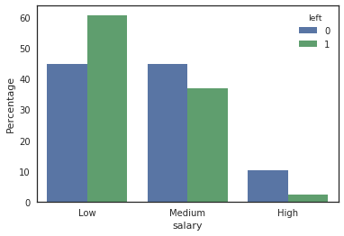


```python
fig, axs = plt.subplots(nrows=1, ncols=3, figsize=(17,6))
sns.factorplot(y="number_project", x="left", data=dataset, kind="bar",ax=axs[0])
axs[1].hist(data_stay["number_project"], bins=6, label="Stay",alpha=0.7)
axs[1].hist(data_left["number_project"], bins=6, label="Left",alpha=0.7)
axs[1].set_xlabel("Number of projects")
axs[1].set_ylabel("Count")
axs[1].legend()

ax = sns.kdeplot(data=data_stay["satisfaction_level"],color='b',shade=True, ax=axs[2])
ax = sns.kdeplot(data=data_left["satisfaction_level"],color='g',shade=True, ax=axs[2])
ax.legend(["Stay", "Left"])
ax.set_xlabel('Satifsfaction level')
ax.set_ylabel('Density')

plt.tight_layout();
plt.gcf().clear()
```


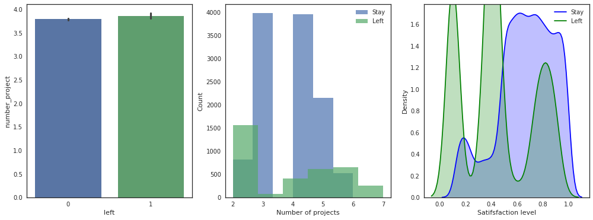


    <matplotlib.figure.Figure at 0x7fe89d0e6588>


```python
fig, axs = plt.subplots(nrows=1,ncols=3,figsize=(17,6))

sns.factorplot(y="last_evaluation",x="left",data=dataset,kind="bar", ax=axs[0])

axs[1].hist(data_stay["last_evaluation"],bins=6,label="Stay",alpha=0.7)
axs[1].hist(data_left["last_evaluation"],bins=6,label="Left",alpha=0.7)
axs[1].set_xlabel("Last evaluation")
axs[1].set_ylabel("Count")
axs[1].legend()

ax = sns.kdeplot(data=data_stay["last_evaluation"],color='b',shade=True, ax=axs[2])
ax = sns.kdeplot(data=data_left["last_evaluation"],color='g',shade=True, ax=axs[2])
ax.legend(["Stay","Left"])
ax.set_xlabel('last_evaluation')
ax.set_ylabel('Density')

plt.tight_layout()
plt.gcf().clear()
```


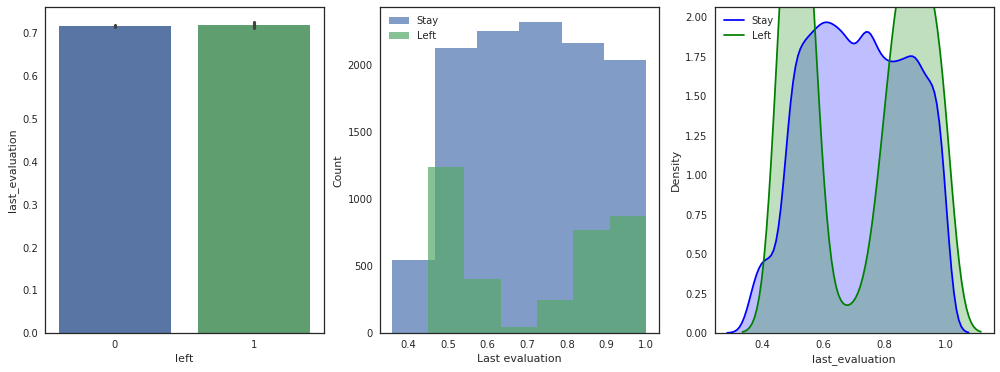


    <matplotlib.figure.Figure at 0x7fe89c252c88>


```python
fig, axs = plt.subplots(nrows=1,ncols=2,figsize=(10,6))
sns.factorplot(y="average_montly_hours",x="left",data=dataset,kind="box", ax=axs[0])
axs[1].hist(data_stay["average_montly_hours"],bins=6,label="Stay",alpha=0.7)
axs[1].hist(data_left["average_montly_hours"],bins=6,label="Left",alpha=0.7)
axs[1].set_xlabel("Average Montly Hours")
axs[1].set_ylabel("Count")
axs[1].legend()
plt.tight_layout()
plt.gcf().clear()
```


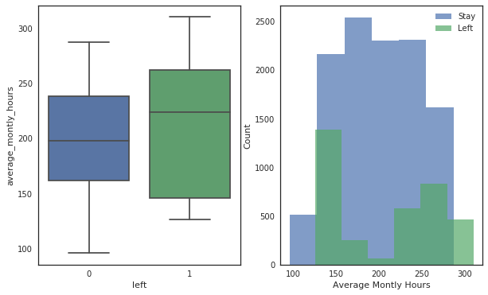


    <matplotlib.figure.Figure at 0x7fe89d19ca20>


```python
g = sns.pairplot(dataset.drop(labels=['promotion_last_5years','Work_accident','salary'],axis=1),hue="left",plot_kws=dict(alpha=0.1))
handles = g._legend_data.values()
labels = g._legend_data.keys()
g.fig.legend(handles=handles, labels=labels, loc='upper center', ncol=1)
g.fig.legend(handles=handles, labels=labels, loc='lower center', ncol=3)
```


    <matplotlib.legend.Legend at 0x7fe896a6be10>


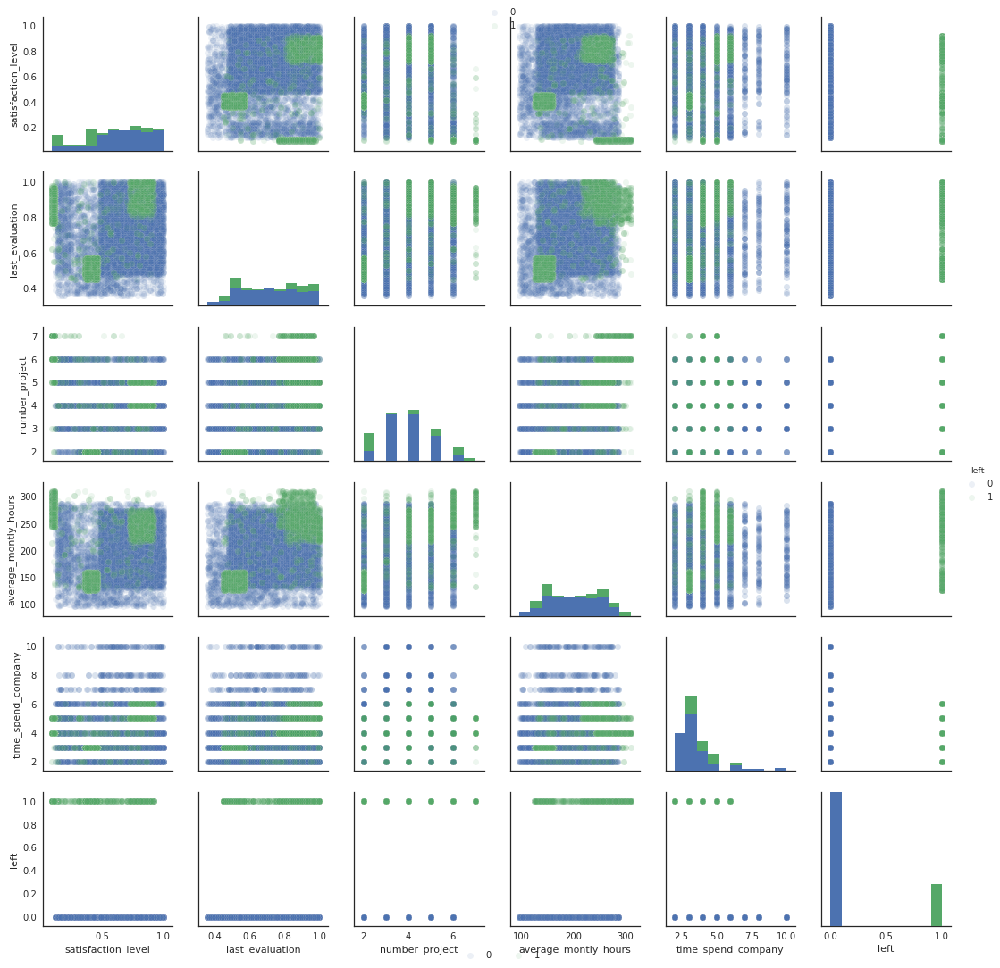


```python
#Deeper in analysis
g = sns.FacetGrid(dataset, col="left",hue="left", size=5, aspect=1.2)
g.map(plt.scatter, "satisfaction_level", "last_evaluation", alpha=0.15)
g.add_legend()

g = sns.FacetGrid(dataset, col="left",size=5,aspect=1.2)
g.map(sns.kdeplot, "satisfaction_level","last_evaluation", shade=True, shade_lowest=False)
g.add_legend()
```


    <seaborn.axisgrid.FacetGrid at 0x7fe8960bec18>


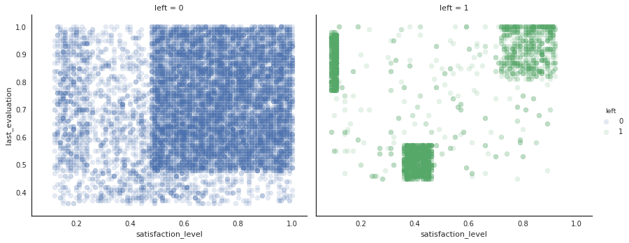


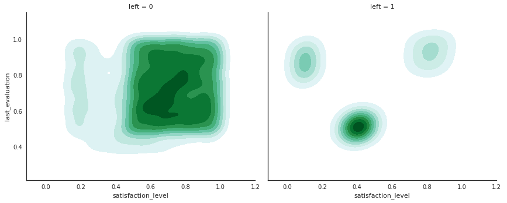


```python
#Lets compare inside the 3 identified groups
kmeans = KMeans(n_clusters=3, random_state=2)
kmeans.fit(data_left[["satisfaction_level","last_evaluation"]])
```


    KMeans(algorithm='auto', copy_x=True, init='k-means++', max_iter=300,
        n_clusters=3, n_init=10, n_jobs=1, precompute_distances='auto',
        random_state=2, tol=0.0001, verbose=0)


```python
kmeans_colors = ['red' if c == 0 else 'orange' if c == 2 else 'blue' for c in kmeans.labels_]

fig = plt.figure(figsize=(10, 7))
plt.scatter(x="satisfaction_level",y="last_evaluation", data=data_left,
            alpha=0.25,color = kmeans_colors)
plt.xlabel("Satisfaction level")
plt.ylabel("Last evaluation")
plt.scatter(x=kmeans.cluster_centers_[:,0],y=kmeans.cluster_centers_[:,1],color="black",marker="X",s=100)
plt.title("Clustering of the employed who left by Kmeans")

plt.show()
```


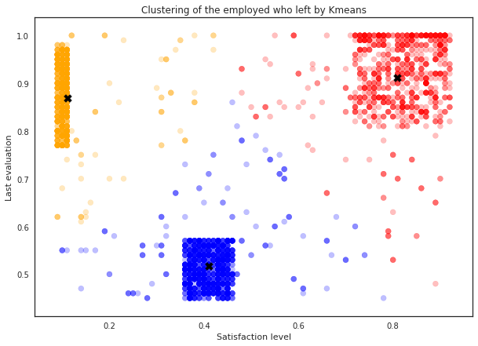


```python
data_left_SuccessHappy = data_left[kmeans.labels_ == 0]
data_left_UnsuccessUnhappy = data_left[kmeans.labels_ == 1]
data_left_SuccessUnhappy = data_left[kmeans.labels_ == 2]

```


```python
data_left_SuccessUnhappy.shape

```


    (944, 9)


```python
data_left_SuccessHappy.shape
```


    (977, 9)


```python
data_left_UnsuccessUnhappy.shape
```


    (1650, 9)


```python
data_left_SuccessUnhappy_mean = data_left_SuccessUnhappy[attributes].mean().values.reshape(1,-1)
data_left_SuccessHappy_mean = data_left_SuccessHappy[attributes].mean().values.reshape(1,-1)
data_left_UnsuccessUnhappy_mean = data_left_UnsuccessUnhappy[attributes].mean().values.reshape(1,-1)

datas = np.concatenate((data_stay_mean,data_left_SuccessUnhappy_mean, 
                        data_left_SuccessHappy_mean,data_left_UnsuccessUnhappy_mean),axis = 0)
```


```python
colors = ["green","red","blue","orange"]
left_types = ["Stayed","Left Success-Unhappy", "Left Success-Happy", "Left Unsucess-Unhappy"]

fig = plt.figure(figsize=(10, 10))
radar = RadarChart(fig, attributes, ranges)
for data, color, left_type in zip(datas, colors, left_types):
    radar.plot(data, color = color, label = left_type,linewidth=2.0)
    radar.fill(data, alpha = 0.1, color = color)
    radar.legend(loc = 1, fontsize = 'small')
plt.title('Stats of employees who stayed and left')
plt.show() 
```


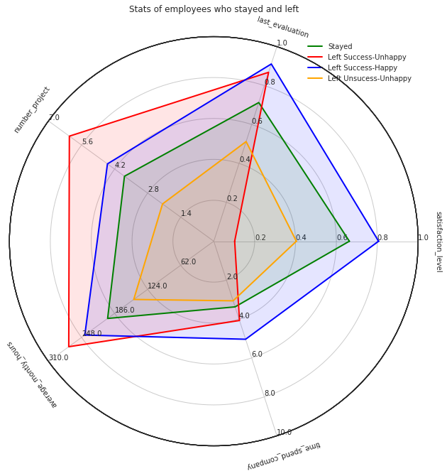


```python
## Prediction of the target variable (stay/left)

X_train = dataset.drop(labels = "left", axis=1)
Y_train = dataset["left"]
train_features = X_train.columns
```


```python
kfold = StratifiedKFold(Y_train, n_folds=10, random_state=2)
```


```python
DTC = DecisionTreeClassifier(max_depth=3)
cv_results = cross_val_score(DTC,X_train, Y_train, cv=kfold,scoring="accuracy")
cv_results.mean()
```


    0.95239079072183286


```python
DTC.fit(X_train, Y_train)
```


    DecisionTreeClassifier(class_weight=None, criterion='gini', max_depth=3,
                max_features=None, max_leaf_nodes=None,
                min_impurity_decrease=0.0, min_impurity_split=None,
                min_samples_leaf=1, min_samples_split=2,
                min_weight_fraction_leaf=0.0, presort=False, random_state=None,
                splitter='best')


```python
### NOT WORKING ON KAGGLE SERVERS (no module pydot nor pydotplus)####
#dot_data = StringIO()

#tree.export_graphviz(DTC, out_file=dot_data,feature_names=train_features)

#graph = pydot.graph_from_dot_data(dot_data.getvalue())[0]
#graph.set_lwidth(400)
#graph.set_lheight(300)

#Image(graph.create_png())


```


```python
RFC = RandomForestClassifier()
cv_results = cross_val_score(RFC,X_train, Y_train, cv=kfold,scoring="accuracy")
cv_results.mean()
```


    0.99140008877040986


```python
RFC.fit(X_train, Y_train)
```


    RandomForestClassifier(bootstrap=True, class_weight=None, criterion='gini',
                max_depth=None, max_features='auto', max_leaf_nodes=None,
                min_impurity_decrease=0.0, min_impurity_split=None,
                min_samples_leaf=1, min_samples_split=2,
                min_weight_fraction_leaf=0.0, n_estimators=10, n_jobs=1,
                oob_score=False, random_state=None, verbose=0,
                warm_start=False)


```python
indices = np.argsort(RFC.feature_importances_)[::-1][:40]

fig = plt.figure(figsize=(7, 10))
g = sns.barplot(y=train_features[indices][:40],x = RFC.feature_importances_[indices][:40] , orient='h')
g.set_xlabel("Relative importance",fontsize=12)
g.set_ylabel("Features",fontsize=12)
g.tick_params(labelsize=9)
g.set_title("Random Forest classifier feature importance")

plt.show()
plt.gcf().clear()
```


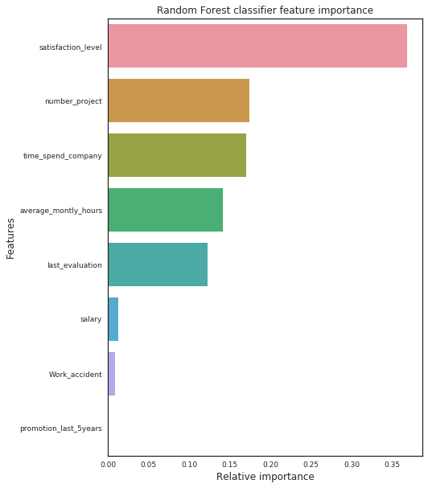


    <matplotlib.figure.Figure at 0x7fe8954527f0>


```python

```
